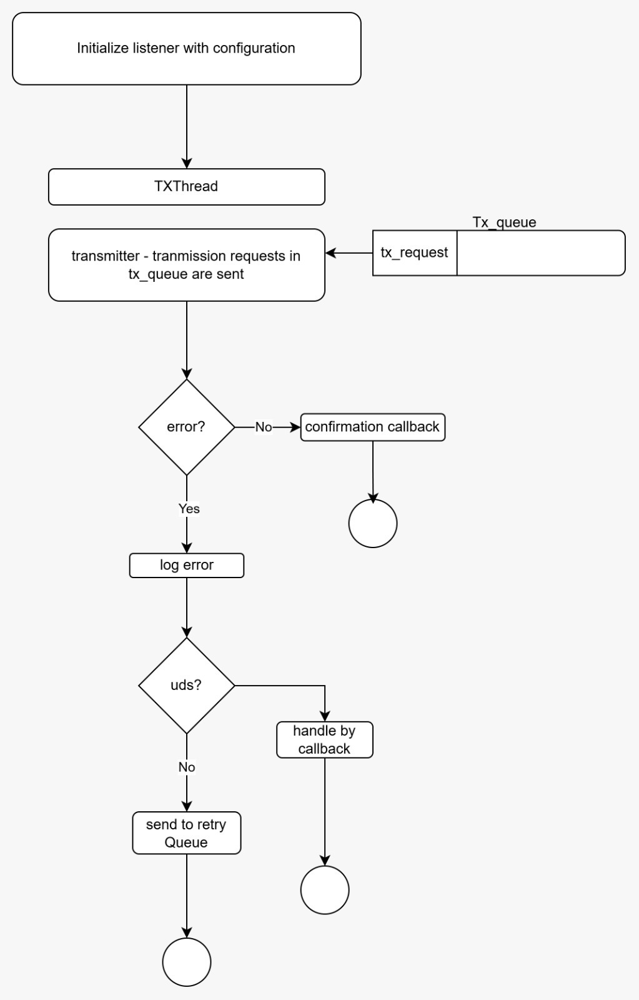
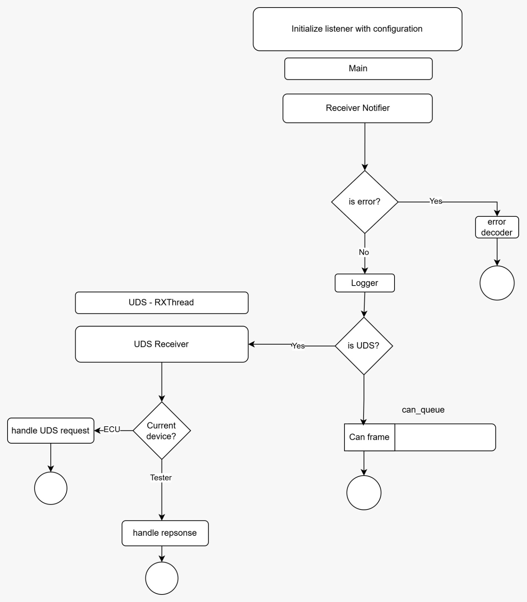
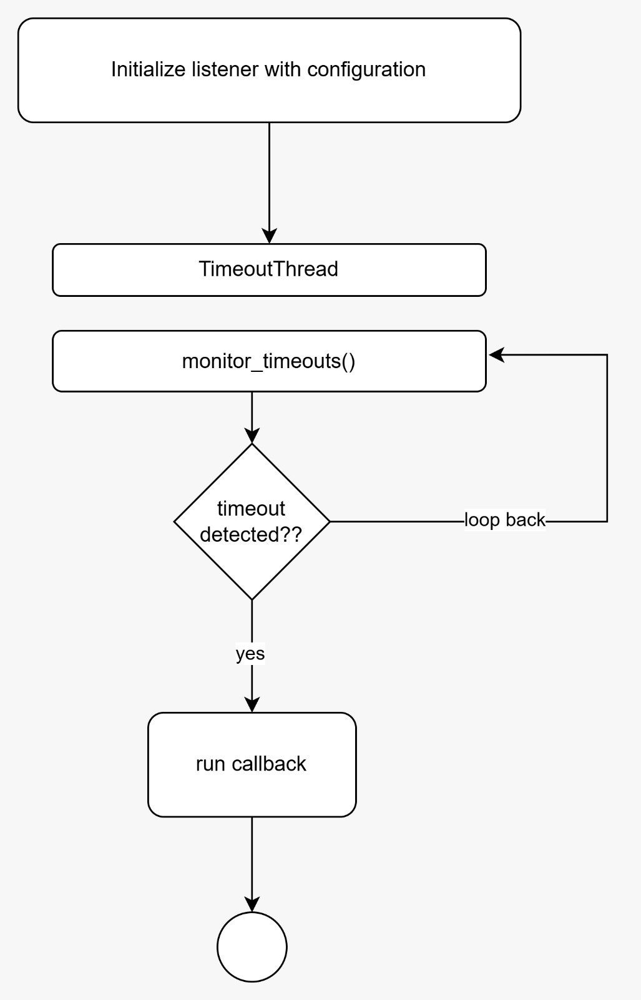
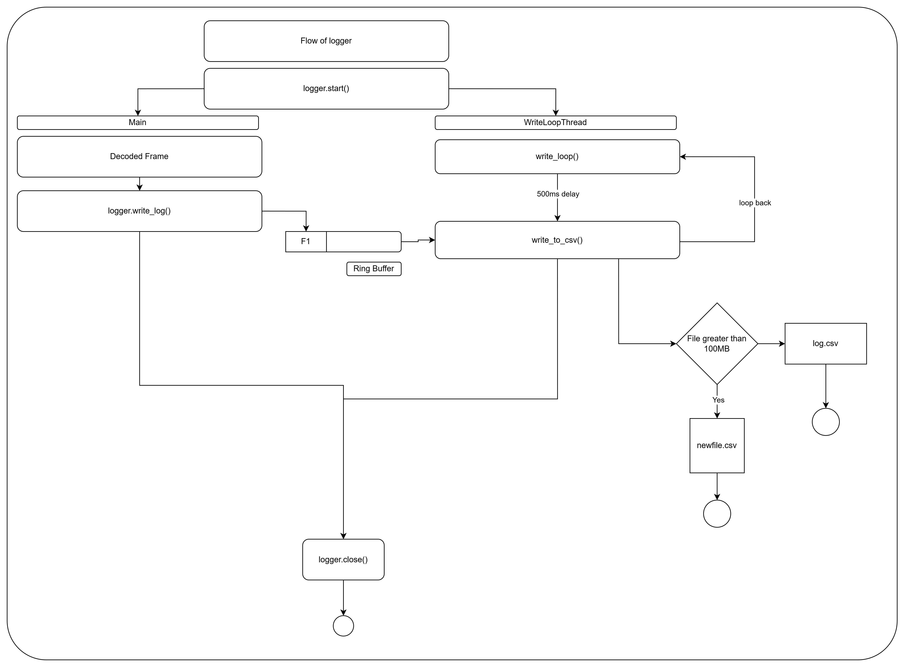

# Low-Level Design (LLD)

---
# Listener
The communication subsystem follows a multi-threaded architecture where:

- **Transmitter** handles all outgoing CAN traffic.
- **Receiver** processes all incoming CAN traffic.
- **Timeout Manager** supervises transmission reliability and recovery.

## 1. Transmitter

The **Transmitter** is responsible for scheduling and sending CAN frames to the bus. It manages the transmission queue, prioritizes messages, interfaces with the SocketCAN driver, handles error and confirmation callbacks.

---
## 2. Receiver

The **Receiver** listens for incoming CAN frames from the SocketCAN interface. It validates received frames, classifies them based on protocol (Raw CAN, ISO-TP, UDS, etc.) and forwards them to the appropriate processing queues.

---
## 3. Timeout Monitor

The **Timeout Monitor** supervises CAN messages that are expected to arrive periodically. Frames can be registered with a configured timeout interval, and the monitor continuously checks whether each registered frame is received within the expected time. If a frame is not received before its timeout expires, a timeout event is generated, allowing the application to detect communication failures or missing ECU messages.

---
# UDS
[Architecture Overview](docs/UDS/SIDandNRC.pdf)

---
# Logger

---
# Simulator and Dashbaoard

---